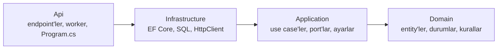
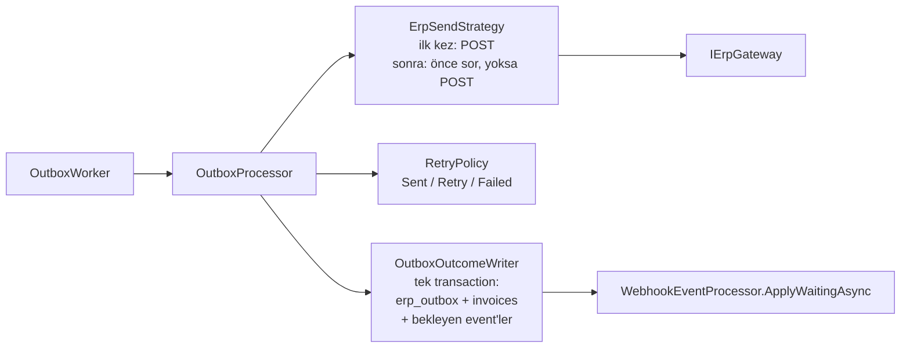

# Mimari

İki uygulama da (Invoice Service ve ERP Simulator) aynı katmanlı yapıdadır: her biri dört projeye bölünmüştür ve
projeler arasındaki referanslar tek yönlüdür. Bu yapı [`gun-4`](https://github.com/metinkaryagdi/Staj_Tasks/tree/gun-4)
tag'indeki tek projelik hâlin **davranışı değiştirilmeden** yeniden düzenlenmiş hâlidir; nasıl doğrulandığı
[aşağıda](#davranışın-değişmediği-nasıl-doğrulandı).

## Katmanlar ve bağımlılık kuralı



| Katman | Ne içerir | Neye bağımlı olabilir |
|---|---|---|
| **Domain** | Entity'ler (`Invoice`, `ErpOutboxEntry`, `ErpWebhookEvent`; simülatörde `ErpInvoice`, `WebhookDelivery`), durum sabitleri, saf kurallar (`InvoiceTransitions`) | Hiçbir şeye (paket referansı yok) |
| **Application** | Use case'ler (bir işin adımlarını yöneten sınıflar), port'lar (dış dünyaya açılan arayüzler), ayarlar ve doğrulayıcıları, saf politikalar (`RetryPolicy`, `BehaviorSelector`, `WebhookPlanner`) | Domain; `Microsoft.Extensions.*` soyutlamaları (Options, Logging, DI) |
| **Infrastructure** | Port'ların gerçek uygulamaları: `DbContext`, migration'lar, SQL içeren store'lar, ERP'ye / Fatura Servisi'ne giden HTTP istemcileri | Application (ve dolaylı olarak Domain); EF Core, Npgsql |
| **Api** | HTTP endpoint'leri (isteği use case'e verir, sonucu HTTP cevabına çevirir), arka plan worker'ları, `Program.cs`, `appsettings*.json` | Hepsi |

Kural: içteki katman dıştakini bilmez. Örneğin `OutboxProcessor` (Application) PostgreSQL'i ya da `HttpClient`'ı
bilmez; yalnızca `IOutboxStore` ve `IErpGateway` port'larını bilir. Bu yüzden birim testlerde bu port'lar
bellek içi sahteleriyle değiştirilebilir (bkz. [Testler](#testler)).

## Invoice Service

```
invoice-service/
  src/
    InvoiceService.Domain/
      Invoices/        Invoice, InvoiceStatus, InvoiceNumber, InvoiceTransitions
      Outbox/          ErpOutboxEntry, OutboxStatus
      Webhooks/        ErpWebhookEvent, WebhookEventType, WebhookEventStatus, IgnoreReason
    InvoiceService.Application/
      Abstractions/    IErpGateway, IInvoiceStore, IOutboxStore, IWebhookEventStore, IUnitOfWork, IDatabaseFailureClassifier
      Invoices/        CreateInvoiceHandler, ResendInvoiceHandler, InvoiceQueries, CreateInvoiceRequest
      Outbox/          OutboxProcessor, ErpSendStrategy, OutboxOutcomeWriter, RetryPolicy, OutboxOptions
      Webhooks/        WebhookEventProcessor, InvoiceEventApplier, ErpWebhookRequest, WebhookSignature, WebhookOptions
      DependencyInjection.cs
    InvoiceService.Infrastructure/
      Persistence/     InvoiceDbContext, Migrations/, InvoiceStore, OutboxStore, WebhookEventStore, UnitOfWork,
                       PostgresFailureClassifier
      Erp/             ErpClient (IErpGateway), ErpOptions
      DependencyInjection.cs
    InvoiceService.Api/
      Invoices/        InvoiceEndpoints, InvoiceResponse
      Webhooks/        WebhookEndpoints, WebhookRequestReader
      Workers/         OutboxWorker
      Startup/         LoggingExtensions, OpenApiExtensions, DatabaseMigrator, SettingsLogger
      Program.cs
  tests/
    InvoiceService.Domain.Tests / .Application.Tests / .Infrastructure.Tests / .Api.Tests
```

### Port'lar

| Port | Ne için | Uygulaması |
|---|---|---|
| `IErpGateway` | ERP'ye faturayı gönder (`SendAsync`), ERP'ye faturayı sor (`FindAsync`); her çağrı tek HTTP isteği | `ErpClient` |
| `IInvoiceStore` | `invoices` tablosu: numara üret, fatura + outbox kaydını birlikte yaz, oku, koşullu güncelle, satır kilidi | `InvoiceStore` |
| `IOutboxStore` | `erp_outbox`: `FOR UPDATE SKIP LOCKED` ile kayıt al, claim hâlâ bizde mi, sonucu claim'e göre yaz, sıfırla | `OutboxStore` |
| `IWebhookEventStore` | `erp_webhook_events`: bir kez sakla (`ON CONFLICT`), oku, bekleyenleri kilitle, `SET LOCAL` süre limitleri | `WebhookEventStore` |
| `IUnitOfWork` | Transaction sınırı: aynı DI scope'undaki store'lar aynı transaction'a katılır | `UnitOfWork` |
| `IDatabaseFailureClassifier` | Veritabanı hatası `lock_timeout` / `statement_timeout` mu (webhook'ta 503 için) | `PostgresFailureClassifier` |

### Akışlar

**Fatura oluşturma** — `POST /api/v1/invoices` → `CreateInvoiceHandler`: doğrula, numara al, faturayı ve outbox
kaydını tek kayıtta yaz (`IInvoiceStore.QueueAsync`) → `202`. ERP bu istekte çağrılmaz.

**Gönderim** — `OutboxWorker` (Api) boş slot kadar kaydı `OutboxProcessor.ClaimAsync` ile alır ve her biri için
yeni bir DI scope'unda `OutboxProcessor.SendAsync` çağırır:



**ERP webhook'u** — `POST /api/v1/erp-webhooks` → `WebhookEndpoints` gövdeyi okur, imzayı ve gövdeyi doğrular,
işi kendi scope'unda `WebhookEventProcessor.ReceiveAsync`'e verir ve en fazla `ResponseBudgetMilliseconds` bekler
(yoksa `503`). `WebhookEventProcessor` event'i bir kez saklar, faturayı kilitler ve `InvoiceEventApplier` ile uygular
(geçiş kuralları `InvoiceTransitions`'ta).

**Yeniden gönderme** — `POST /api/v1/invoices/{n}/resend` → `ResendInvoiceHandler`: yalnızca Başarısız fatura
Bekliyor'a döner ve outbox kaydı sıfırlanır (tek transaction); sonuç `Queued` / `NotFound` / `NotFailed` → `202` /
`404` / `409`.

## ERP Simulator

```
erp-simulator/
  src/
    ErpSimulator.Domain/
      Invoices/        ErpInvoice
      Webhooks/        WebhookDelivery, DeliveryStatus, DeliveryKind, ErpEventType
    ErpSimulator.Application/
      Abstractions/    IErpInvoiceStore, IWebhookDeliveryStore, IWebhookTransport, IUnitOfWork
      Invoices/        SubmitInvoiceHandler, InvoiceLookup, CreateInvoiceRequest
      Simulation/      BehaviorSelector, SimulatorOptions
      Webhooks/        WebhookSender, WebhookPlanner, WebhookSignature, WebhookOptions
      DependencyInjection.cs
    ErpSimulator.Infrastructure/
      Persistence/     ErpDbContext, Migrations/, ErpInvoiceStore, WebhookDeliveryStore, UnitOfWork
      Webhooks/        HttpWebhookTransport (IWebhookTransport)
      DependencyInjection.cs
    ErpSimulator.Api/
      Invoices/        InvoiceEndpoints, InvoiceResponses
      Workers/         WebhookDispatcher
      Startup/         LoggingExtensions, OpenApiExtensions, DatabaseMigrator, SettingsLogger
      Program.cs
  tests/
    ErpSimulator.Application.Tests / .Infrastructure.Tests
```

**Fatura POST'u** — `InvoiceEndpoints` → `SubmitInvoiceHandler`: doğrula, (idempotent modda) fatura numarasını
kilitle ve var olan kaydı ara, davranışı seç (`BehaviorSelector`), davranışa göre kaydet (`IErpInvoiceStore.SaveAsync`
kaydı ve `WebhookPlanner`'ın planladığı event'leri tek transaction'da yazar), geç cevapta bekle. Sonucu
(`Decided` / `Duplicate` / `Conflict` / `Invalid`) HTTP cevabına endpoint çevirir (`202`, `429` + `Retry-After`,
`500`, `409`, `400`).

**Webhook gönderimi** — `WebhookDispatcher` (Api) yalnızca döngüdür: zamanı gelen satırları alır, aynı anda en fazla
`MaxConcurrentSends` gönderir. Her satır için `WebhookSender` imzalar (fake: yanlış anahtar, replay: eski timestamp),
`IWebhookTransport` ile gönderir, sonucu ve bekleyen replay'leri tek transaction'da yazar.

## Hangi dosya nereye gitti

### Invoice Service

| `gun-4` (tek proje) | Şimdi |
|---|---|
| `Program.cs` (139 satır) | `Api/Program.cs` (41) + `Api/Startup/*` + `Application/DependencyInjection.cs` + `Infrastructure/DependencyInjection.cs` |
| `Data/Invoice.cs`, `ErpOutboxEntry.cs`, `ErpWebhookEvent.cs` | `Domain/Invoices/`, `Domain/Outbox/`, `Domain/Webhooks/` |
| `Data/InvoiceDbContext.cs`, `Data/Migrations/` | `Infrastructure/Persistence/` (numara üretimi `InvoiceStore`'a geçti) |
| `Outbox/OutboxProcessor.cs` (257) | `Application/Outbox/OutboxProcessor.cs` (129, yalnızca akış) + `ErpSendStrategy.cs` (sor/gönder kararı) + `OutboxOutcomeWriter.cs` (sonuç transaction'ı) + `Infrastructure/Persistence/OutboxStore.cs` (claim SQL'i) |
| `Outbox/OutboxWorker.cs` | `Api/Workers/OutboxWorker.cs` |
| `Outbox/RetryPolicy.cs`, `OutboxOptions.cs` | `Application/Outbox/` |
| `Erp/ErpClient.cs` | `Infrastructure/Erp/ErpClient.cs`; sonuç tipleri (`ErpSendResult`, `ErpLookupResult`) `Application/Abstractions/IErpGateway.cs`'e |
| `Webhooks/WebhookEventProcessor.cs` (176) | `Application/Webhooks/WebhookEventProcessor.cs` (akış) + `InvoiceEventApplier.cs` (bir event'i uygulama) + `Infrastructure/Persistence/WebhookEventStore.cs` (SQL) |
| `Webhooks/WebhookEndpoints.cs` (193) | `Api/Webhooks/WebhookEndpoints.cs` + `WebhookRequestReader.cs`; PostgreSQL hata kodları `Infrastructure/Persistence/PostgresFailureClassifier.cs`'e |
| `Webhooks/InvoiceTransitions.cs` | `Domain/Invoices/InvoiceTransitions.cs` (`IgnoreReason` → `Domain/Webhooks/IgnoreReason.cs`) |
| `Webhooks/WebhookSignature.cs`, `WebhookOptions.cs`, `WebhookContracts.cs` | `Application/Webhooks/` (`ErpWebhookRequest.cs`) |
| `Invoices/InvoiceEndpoints.cs` (176) | `Api/Invoices/InvoiceEndpoints.cs` (ince) + `Application/Invoices/CreateInvoiceHandler.cs`, `ResendInvoiceHandler.cs`, `InvoiceQueries.cs` |
| `Invoices/InvoiceContracts.cs` | `CreateInvoiceRequest` → `Application/Invoices/`; `InvoiceResponse` → `Api/Invoices/` |

### ERP Simulator

| `gun-4` (tek proje) | Şimdi |
|---|---|
| `Program.cs` (136) | `Api/Program.cs` (40) + `Api/Startup/*` + iki `DependencyInjection.cs` |
| `Data/ErpInvoice.cs`, `WebhookDelivery.cs` | `Domain/Invoices/`, `Domain/Webhooks/` |
| `Data/ErpDbContext.cs`, `Data/Migrations/` | `Infrastructure/Persistence/` |
| `Invoices/InvoiceEndpoints.cs` (258) | `Api/Invoices/InvoiceEndpoints.cs` (HTTP cevabı) + `Application/Invoices/SubmitInvoiceHandler.cs` (davranış, kayıt, geç cevap) + `InvoiceLookup.cs` + `Infrastructure/Persistence/ErpInvoiceStore.cs` (kilit, kayıt) |
| `Invoices/InvoiceContracts.cs` | `CreateInvoiceRequest` → `Application/Invoices/`; cevap tipleri → `Api/Invoices/InvoiceResponses.cs` |
| `Webhooks/WebhookDispatcher.cs` (219) | `Api/Workers/WebhookDispatcher.cs` (döngü) + `Application/Webhooks/WebhookSender.cs` (imza, sonuç) + `Infrastructure/Webhooks/HttpWebhookTransport.cs` + `Infrastructure/Persistence/WebhookDeliveryStore.cs` |
| `Simulation/*`, `Webhooks/WebhookPlanner.cs`, `WebhookSignature.cs`, `WebhookOptions.cs` | `Application/Simulation/`, `Application/Webhooks/` |

En büyük kaynak dosya 258 satırdan 164 satıra indi. Toplam satır sayısı ise arttı (arayüzler, DI kayıtları ve
açıklamalar yüzünden); kazanç dosya başına düşen sorumluluktadır, satır sayısında değil.

## Testler

| Proje | Ne test eder |
|---|---|
| `*.Domain.Tests` | Saf kurallar: durum geçişleri, fatura numarası biçimi |
| `*.Application.Tests` | Politikalar ve doğrulamalar (`RetryPolicy`, imza, ayarlar, istek doğrulama, `BehaviorSelector`, `WebhookPlanner`) ve **use case'ler port'ların bellek içi sahteleriyle** (`Fakes/`): veritabanı ve HTTP olmadan gönderim akışı, yeniden gönderme, webhook işleme, simülatörün davranışları ve webhook gönderimi |
| `*.Infrastructure.Tests` | `ErpClient` (sahte `HttpMessageHandler` ile), ERP ayarları, migration'ların modeli hâlâ tarif ettiği (veritabanı gerekmez) |
| `InvoiceService.Api.Tests` | Projeyle gelen `appsettings.json` değerleri |

```bash
dotnet test invoice-service
dotnet test erp-simulator
```

## Bilinçli uzlaşmalar

Kitaptaki en katı hâli değil, davranışı değiştirmeden varılabilen pragmatik hâlidir:

- **Tracked entity'ler port sözleşmesinde.** `IInvoiceStore.LockAsync` ve `IWebhookEventStore.GetTrackedAsync`
  EF'in takip ettiği nesneleri döndürür; değişiklikler `IUnitOfWork.SaveChangesAsync` ile yazılır. Port'lar EF'e
  bağlı değildir ama bu davranışı varsayar. Mantığı aynı tutmanın en az değişiklikli yolu buydu.
- **Simülatörde kilit ve kayıt örtük bağlı.** `IErpInvoiceStore.LockInvoiceNumberAsync`'in açtığı transaction'ı
  `SaveAsync` kendisi bulur ve commit eder (eski kodla aynı).
- **Application, `Microsoft.Extensions.*` soyutlamalarını kullanır** (Options, Logging, DI). Yaygın kabul gören bir
  uzlaşmadır; somut altyapıya (EF, HTTP) bağımlılık yoktur.
- **SQL'ler olduğu gibi taşındı.** `FOR UPDATE SKIP LOCKED`, `ON CONFLICT`, `SET LOCAL` gibi ifadeler doğruluk için
  kritik olduğundan yeniden yazılmadı; Infrastructure'daki store'larda duruyorlar.
- **Log kategorileri.** Mesaj metinleri aynı; sınıf adından gelen kategoriler yeni namespace'leri taşır (örn.
  `InvoiceService.Application.Outbox.OutboxProcessor`). Bunu kullanan `manual-tests/gun3` script'leri güncellendi.
  Fatura use case'leri (`InvoiceService.Invoices`, `ErpSimulator.Invoices`) ve simülatörün `webhooks` HttpClient'ı
  eski kategorilerini korur.

## Davranışın değişmediği nasıl doğrulandı

Eski (`gun-4`) ve yeni sürüm aynı anda, ayrı veritabanlarıyla çalıştırılıp karşılaştırıldı:

- **Birim testler:** eski testlerin hepsi (171 + 68) taşındıkları projelerde değişmeden geçiyor.
- **HTTP sözleşmesi:** doğrulama hataları, 404/409, imzasız/süresi geçmiş/bozuk webhook (401/400), tekrar event,
  413 — Fatura Servisi'nde 13, simülatörde 89 cevap birebir aynı (zaman damgaları hariç).
- **Yük testi:** 40 fatura, varsayılan hata oranları ve webhook sorunlarıyla — fatura/outbox/event durum dağılımları,
  yok sayma nedenleri, tekrar sayısı, ERP'deki çift kayıt (0) ve tutarlılık kontrolleri birebir aynı. Hangi faturanın
  hangi davranışı aldığı iki sürümde de çalıştırmadan çalıştırmaya değişir (10 paralel gönderim).
- **Senaryolar:** ERP kapalıyken Başarısız → ERP açılınca yeniden gönderme (önce sorup sonra gönderiyor); satır kilidi
  tutulurken gelen event `503 lock-timeout` ve sonraki teslimatta işleniyor; idempotent modda Duplicate/409, HTTP-date
  `Retry-After`, istemci giderken geç cevabın kaydı koruması; seed'li davranış dizisi (500 istek) aynı.
- **Şema:** migration'lar modeli birebir tarif ediyor (`ModelSnapshotTests`); yeni migration yok.
