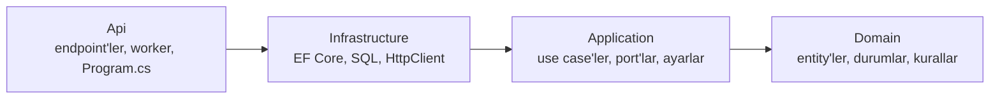
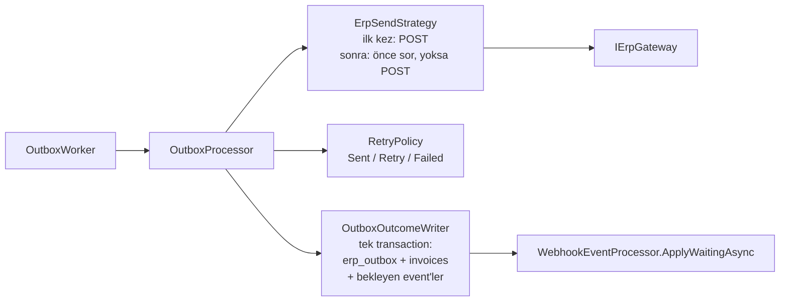
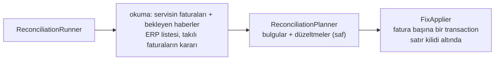

# Mimari

İki uygulama da (Invoice Service ve ERP Simulator) aynı katmanlı yapıdadır: her biri dört projeye bölünmüştür ve
projeler arasındaki referanslar tek yönlüdür. Üçüncü uygulama olan operasyon ekranı (`operations-ui`) tarayıcıda çalışan
küçük bir React uygulamasıdır; katmanlara bölünmemiştir ve yalnızca Invoice Service'in HTTP API'sini kullanır
(bkz. [Operasyon Ekranı](#operasyon-ekranı)).

## Katmanlar ve bağımlılık kuralı



| Katman | Ne içerir | Neye bağımlı olabilir |
|---|---|---|
| **Domain** | Entity'ler (`Invoice`, `ErpOutboxEntry`, `ErpWebhookEvent`; simülatörde `ErpInvoice`, `WebhookDelivery`), durum sabitleri, saf kurallar (`InvoiceTransitions`) | Hiçbir şeye (paket referansı yok) |
| **Application** | Use case'ler (bir işin adımlarını yöneten sınıflar), port'lar (dış dünyaya açılan arayüzler), ayarlar ve doğrulayıcıları, saf politikalar (`RetryPolicy`, `BehaviorSelector`, `WebhookPlanner`) | Domain; `Microsoft.Extensions.*` soyutlamaları (Options, Logging, DI) |
| **Infrastructure** | Port'ların gerçek uygulamaları: `DbContext`, migration'lar, SQL içeren store'lar, ERP'ye / Fatura Servisi'ne giden HTTP istemcileri | Application (ve dolaylı olarak Domain); EF Core, Npgsql |
| **Api** | HTTP endpoint'leri (isteği use case'e verir, sonucu HTTP cevabına çevirir), arka plan worker'ları, `Program.cs`, `appsettings*.json` | Hepsi |

Kural: içteki katman dıştakini bilmez. Örneğin `OutboxProcessor` (Application) PostgreSQL'i ya da `HttpClient`'ı
bilmez; yalnızca `IOutboxStore` ve `IErpGateway` port'larını bilir. Bu yüzden birim testlerde bu port'lar
bellek içi sahteleriyle değiştirilebilir (bkz. [Testler](#testler)).

## Invoice Service

```
invoice-service/
  src/
    InvoiceService.Domain/
      Invoices/        Invoice, InvoiceStatus, InvoiceNumber, InvoiceTransitions, ErpCheckResult, InvoiceFollowUp
      Operators/       OperatorAction, OperatorActionType, OperatorActionResult
      Outbox/          ErpOutboxEntry, OutboxStatus
      Webhooks/        ErpWebhookEvent, WebhookEventType, WebhookEventStatus, IgnoreReason
      Reconciliation/  ReconciliationRun, ReconciliationFinding, ReconciliationStatus, FindingType, FindingAction
    InvoiceService.Application/
      Abstractions/    IErpGateway, IInvoiceStore, IOutboxStore, IWebhookEventStore, IReconciliationStore, IReconciliationLock,
                       IOperatorActionStore, IInvoiceFollowUpStore, IUnitOfWork, IDatabaseFailureClassifier
      Invoices/        CreateInvoiceHandler, ResendInvoiceHandler, ResendInvoicesHandler, InvoiceFollowUpHandler, InvoiceQueries,
                       InvoiceReadModels, CreateInvoiceRequest
      Outbox/          OutboxProcessor, ClaimedEntry, ErpSendStrategy, OutboxOutcomeWriter, RetryPolicy, OutboxOptions
      Webhooks/        WebhookEventProcessor, InvoiceEventApplier, ErpWebhookRequest, WebhookSignature, WebhookOptions
      Reconciliation/  ReconciliationService, ReconciliationRunner, ReconciliationPlanner, ReconciliationPlan, FixApplier,
                       ReconciliationQueries, ReconciliationOptions
      DependencyInjection.cs
    InvoiceService.Infrastructure/
      Persistence/     InvoiceDbContext, Migrations/, InvoiceStore, OutboxStore, WebhookEventStore, UnitOfWork,
                       ReconciliationStore, OperatorActionStore, InvoiceFollowUpStore, AdvisoryReconciliationLock,
                       PostgresFailureClassifier
      Erp/             ErpClient (IErpGateway), ErpOptions
      DependencyInjection.cs
    InvoiceService.Api/
      Invoices/        InvoiceEndpoints, InvoiceResponse, InvoiceReadResponses, BulkResendResponses
      Webhooks/        WebhookEndpoints, WebhookRequestReader
      Reconciliation/  ReconciliationEndpoints, ReconciliationResponses
      Operators/       OperatorHeader (X-Operator-Name okuma ve doğrulama)
      Workers/         OutboxWorker, ReconciliationWorker
      Paging.cs        sayfalı listelerin page / pageSize doğrulaması
      Startup/         LoggingExtensions, OpenApiExtensions, DatabaseMigrator, SettingsLogger, CorsExtensions
      Program.cs
  tests/
    InvoiceService.Domain.Tests / .Application.Tests / .Infrastructure.Tests / .Api.Tests / .IntegrationTests
```

### Port'lar

| Port | Ne için | Uygulaması |
|---|---|---|
| `IErpGateway` | ERP'ye faturayı gönder (`SendAsync`), faturayı ve kararını sor (`FindAsync`), aralıktaki kayıtları listele (`ListAsync`) | `ErpClient` |
| `IInvoiceStore` | `invoices` tablosu: numara üret, fatura + outbox kaydını birlikte yaz, oku, sayfalı liste ve arama, durum başına sayı ve takılı sayısı, koşullu güncelle, satır kilidi | `InvoiceStore` |
| `IOutboxStore` | `erp_outbox`: `FOR UPDATE SKIP LOCKED` ile kayıt al, claim hâlâ bizde mi, sonucu claim'e göre yaz, sıfırla, faturanın kaydını oku | `OutboxStore` |
| `IWebhookEventStore` | `erp_webhook_events`: bir kez sakla (`ON CONFLICT`), oku, faturanın haberlerini listele, bekleyenleri kilitle, `SET LOCAL` süre limitleri | `WebhookEventStore` |
| `IUnitOfWork` | Transaction sınırı: aynı DI scope'undaki store'lar aynı transaction'a katılır | `UnitOfWork` |
| `IReconciliationStore` | `reconciliation_runs` / `reconciliation_findings`; mutabakatın okuduğu fatura ve haber listeleri; bir faturanın bulguları; ERP'ye sorulan faturalara cevabın yazılması | `ReconciliationStore` |
| `IOperatorActionStore` | `operator_actions`: müdahaleyi açık transaction'da hemen yaz, bir faturanın müdahalelerini oku | `OperatorActionStore` |
| `IInvoiceFollowUpStore` | `invoice_follow_ups`: açık takibi bul, geçmişi oku, yaz, kapat; bir sayfanın açık takiplerini tek sorguda oku | `InvoiceFollowUpStore` |
| `IReconciliationLock` | Aynı anda tek mutabakat: bırakılana kadar tutulan kilit; başkasındaysa `null` | `AdvisoryReconciliationLock` |
| `IDatabaseFailureClassifier` | Veritabanı hatası `lock_timeout` / `statement_timeout` mu (webhook'ta 503 için) | `PostgresFailureClassifier` |

### Akışlar

**Fatura oluşturma** — `POST /api/v1/invoices` → `CreateInvoiceHandler`: doğrula, numara al, faturayı ve outbox
kaydını tek kayıtta yaz (`IInvoiceStore.QueueAsync`) → `202`. ERP bu istekte çağrılmaz.

**Gönderim** — `OutboxWorker` (Api) boş slot kadar kaydı `OutboxProcessor.ClaimAsync` ile alır ve her biri için
yeni bir DI scope'unda `OutboxProcessor.SendAsync` çağırır:



**ERP webhook'u** — `POST /api/v1/erp-webhooks` → `WebhookEndpoints` gövdeyi okur, imzayı ve gövdeyi doğrular,
işi kendi scope'unda `WebhookEventProcessor.ReceiveAsync`'e verir ve en fazla `ResponseBudgetMilliseconds` bekler
(yoksa `503`). `WebhookEventProcessor` event'i bir kez saklar, faturayı kilitler ve `InvoiceEventApplier` ile uygular
(geçiş kuralları `InvoiceTransitions`'ta).

**Mutabakat** — `ReconciliationWorker` ayardaki aralıkta, `POST /api/v1/reconciliation-runs` ise istendiğinde
`ReconciliationService.TryStartAsync`'i çağırır: kilit alınırsa çalışma `Çalışıyor` olarak kaydedilir (alınamazsa
`null`; endpoint `409`, worker o turu atlar). `ReconciliationRunner` önce her şeyi okur, sonra yazar:



ERP'ye ulaşılamazsa çalışma Başarısız olur ve hiçbir fatura değişmemiştir (yazma henüz başlamamıştır).

**Yeniden gönderme** — `POST /api/v1/invoices/{n}/resend` → endpoint `X-Operator-Name`'i okur (`OperatorHeader`; yoksa
`400`) → `ResendInvoiceHandler`: yalnızca Başarısız fatura Bekliyor'a döner ve outbox kaydı sıfırlanır; `operator_actions`
kaydı aynı transaction'da yazılır (reddedilen istekte yalnızca kayıt); sonuç `Queued` / `NotFound` / `NotFailed` → `202` /
`404` / `409`.

**Toplu yeniden gönderme** — `POST /api/v1/invoices/resend` → `ResendInvoicesHandler`: 1–100 numara; tekrarlanan numara
bir kez işlenir; her numara sırayla `ResendInvoiceHandler`'dan (kendi transaction'ıyla) geçer, böylece tekli resend'in
kuralları ve aynı anda iki resend'e karşı koşullu UPDATE aynen geçerlidir. Bir faturanın hatası diğerlerini durdurmaz;
cevap her fatura için ayrı sonuçtur (`queued`, `not_found`, `not_failed` + şu anki durum, `error`). Her fatura kendi
`operator_actions` satırını alır; hata veren faturanın transaction'ı geri alındığı için hatası ayrıca yazılır.

**Elle takip** — `POST /api/v1/invoices/{n}/follow-up` (ve `/close`) → `InvoiceFollowUpHandler`: faturanın satır kilidi alınır, fatura
takılı değilse ya da açık takibi varsa reddedilir; takip ve `operator_actions` kaydı aynı transaction'dadır. Fatura değişmez.

**Ekranın okumaları** — `InvoiceQueries`: sayfalı liste, arama ve takılı süzgeci (`ListPageAsync`), özet (`CountByStatusAsync`,
`CountStuckAsync`), detay (fatura, outbox kaydı, haberler, bulgular ve müdahaleler; ayrı okumalar, tek anlık görüntü değil).
`ReconciliationQueries`: sayfalı çalışma listesi ve bir çalışmanın bulguları.

## ERP Simulator

```
erp-simulator/
  src/
    ErpSimulator.Domain/
      Invoices/        ErpInvoice
      Webhooks/        WebhookDelivery, DeliveryStatus, DeliveryKind, ErpEventType
    ErpSimulator.Application/
      Abstractions/    IErpInvoiceStore, IWebhookDeliveryStore, IWebhookTransport, IUnitOfWork
      Invoices/        SubmitInvoiceHandler, InvoiceLookup, InvoiceListing, InvoiceDecisions, CreateInvoiceRequest
      Simulation/      BehaviorSelector, SimulatorOptions
      Webhooks/        WebhookSender, WebhookPlanner, WebhookSignature, WebhookOptions
      DependencyInjection.cs
    ErpSimulator.Infrastructure/
      Persistence/     ErpDbContext, Migrations/, ErpInvoiceStore, WebhookDeliveryStore, UnitOfWork
      Webhooks/        HttpWebhookTransport (IWebhookTransport)
      DependencyInjection.cs
    ErpSimulator.Api/
      Invoices/        InvoiceEndpoints, InvoiceResponses
      Workers/         WebhookDispatcher
      Startup/         LoggingExtensions, OpenApiExtensions, DatabaseMigrator, SettingsLogger
      Program.cs
  tests/
    ErpSimulator.Application.Tests / .Infrastructure.Tests
```

**Fatura POST'u** — `InvoiceEndpoints` → `SubmitInvoiceHandler`: doğrula, (idempotent modda) fatura numarasını
kilitle ve var olan kaydı ara, davranışı seç (`BehaviorSelector`), davranışa göre kaydet (`IErpInvoiceStore.SaveAsync`
kaydı ve `WebhookPlanner`'ın planladığı event'leri tek transaction'da yazar), geç cevapta bekle. Sonucu
(`Decided` / `Duplicate` / `Conflict` / `Invalid`) HTTP cevabına endpoint çevirir (`202`, `429` + `Retry-After`,
`500`, `409`, `400`).

**Webhook gönderimi** — `WebhookDispatcher` (Api) yalnızca döngüdür: zamanı gelen satırları alır, aynı anda en fazla
`MaxConcurrentSends` gönderir. Her satır için `WebhookSender` imzalar (fake: yanlış anahtar, replay: eski timestamp),
`IWebhookTransport` ile gönderir, sonucu ve bekleyen replay'leri tek transaction'da yazar.

## Operasyon Ekranı

```
operations-ui/
  src/
    api/          client (fetch, hata türleri), endpoints, queries (TanStack Query tanımları), types
    pages/        SummaryPage, InvoiceListPage, InvoiceDetailPage, ReconciliationPage
    components/   Layout, OperatorGate (ad sorulmadan sayfa açılmaz), QueryState, Notice, StatusBadge, RefreshStamp, ErrorBoundary
    operator.ts   kullanıcının adı (localStorage), X-Operator-Name başlığı
    tr.ts         ekrandaki bütün metinler ve hata mesajları
    selection.ts  toplu seçim (en fazla 100)
    config.ts     servis adresi, yenileme aralığı, zaman aşımı
  Dockerfile      node ile derler, nginx ile sunar
  nginx.conf
```

Sayfalar tarayıcıdan doğrudan Invoice Service'e gider (`VITE_API_URL`, derlemede gömülür). Her sorgu
TanStack Query ile 10 saniyede bir yenilenir; bir hata, varsa son bilinen veriyle birlikte uyarı olarak gösterilir ve bir
sonraki yenileme başarılı olunca kendiliğinden kalkar. Reddedilen müdahalede servis cevabındaki `code` alanı
(`invoice_not_failed`, `invoice_not_found`, `reconciliation_running`) Türkçe mesaja çevrilir.

## Tasarım kararları

Kod içindeki açıklamalar kısa tutuldu; bir kararın neden böyle olduğu burada.

### Gönderim (Invoice Service, outbox)

- **Önce sor, sonra gönder.** ERP bir faturayı kaydedip bunu bize söylemeyebilir (kaydettikten sonra 500, zaman
  aşımından sonra gelen cevap, gönderim sırasında öldürülen servis). Bu yüzden daha önce denenmiş bir fatura için
  `ErpSendStrategy` önce ERP'ye sorar; yalnızca ERP açıkça "yok" (404) derse yeniden POST eder. Cevap belirsizse hiçbir
  şey göndermez, deneme sonra tekrarlanır.
- **Bu korumanın sınırı.** ERP'nin, aldığı bir isteği sorulduğu anda göstermesine dayanır. Simülatör cevap vermeden
  önce kaydettiği için hep gösterir; ama kaydı daha da geciktiren bir ERP 404 dönebilir ve fatura iki kez kaydedilebilir.
  Bunu yalnızca ERP'nin aynı fatura numarasına ikinci kaydı reddetmesi kesin önler (`Simulator:IdempotentInvoices`,
  varsayılanı kapalı).
- **Vazgeçmeden önce son kez sorma.** Son deneme ERP'de kaydedilmiş olabilir. Bu yüzden Başarısız yazmadan önce ERP'ye
  bir kez daha sorulur; kayıt varsa fatura Gönderildi olur. Son denemesi yarıda kalan kayıt (sayaç zaten sınırda) bir
  daha POST edilmez, yalnızca sorulur.
- **Deneme, gönderimden önce sayılır.** Kayıt alınırken (`OutboxStore.ClaimAsync`) sayılır; cevap hiç gelmese de deneme
  kayıtlı kalır. Bu yüzden `send_attempt_count` ERP'nin aldığı POST sayısından büyük olabilir.
- **İki kopya aynı kaydı almaz.** Kayıt alma tek SQL ifadesidir: `FOR UPDATE SKIP LOCKED` ile her kopya diğerinin
  aldığı satırları atlar; `locked_until` satırın kime ait olduğunu ifade bittikten sonra da gösterir.
- **Claim token.** Her alımda yeni bir kimlik yazılır. Kilidi süresi dolmuş (örneğin takılıp kalmış) bir worker'ın
  kimliği artık eşleşmez; ne POST edebilir ne de sonucu, kaydı ondan sonra alanın sonucunun üzerine yazabilir.
- **Kilit süresi.** `Outbox:LockSeconds`, bir denemenin en uzun süresinden (sor + gönder + son kez sor =
  3 × `Erp:TimeoutSeconds`) uzun olmak zorunda; değilse ikinci bir worker hâlâ gönderilmekte olan kaydı alabilir.
- **Jitter.** Birlikte hata alan faturalar (örneğin ERP kapalıyken) aynı anda yeniden denenip toparlanan ERP'ye tek
  dalga hâlinde yüklenmesin diye bekleme süresine rastgele bir sapma eklenir. 429'da eklenmez; ERP ne zaman
  denenebileceğini zaten söylemiştir.
- **60 saniye sınırı planlanan beklemeye aittir.** Worker kuyruğa birkaç yüz milisaniyede bir baktığı için iki deneme
  arasında ölçülen süre bu sınırı birkaç milisaniye aşabilir (Gün 3'te 60,010 sn ölçüldü). Bunu ayrıca bir ayarla
  telafi etmek yerine bilinen bir sınır olarak bırakıldı.
- **HTTP istemcisinde retry yok.** Her çağrı tam bir HTTP isteğidir; tekrar deneme kararı yalnızca `RetryPolicy`'dedir.

### ERP haberleri (Invoice Service)

- **Faturadan önce gelen haber.** Bekliyor olarak saklanır. Haberle ilgili her karar faturanın satır kilidi
  (`SELECT ... FOR UPDATE`) tutularak verilir; outbox da faturayı Gönderildi yaparken aynı satırı kilitler. Böylece
  "fatura henüz Gönderildi değil, haber beklesin" ile "fatura artık Gönderildi, bekleyenleri işle" iç içe geçemez.
- **Bekleyen haberler geliş sırasıyla işlenir** (`received_at`), oluşma zamanına göre değil. Böylece bir haber, fatura
  geldiği anda Gönderildi olsa da olmasa da aynı sonucu verir.
- **Aynı haberin aynı anda gelmesi.** `INSERT ... ON CONFLICT (event_id)`: satırı yalnızca bir istek ekler, diğerleri
  onun kilidini bekleyip yalnızca `delivery_count`'u artırır (`RETURNING xmax = 0` hangisinin eklediğini söyler).
  Faturaya yalnızca ekleyen istek işler.
- **5 saniye kuralı.** Haber, isteğin kendisinden ayrı bir DI scope'unda işlenir ve cevap en fazla
  `ResponseBudgetMilliseconds` bekler; süre dolarsa 503 döner ve ERP haberi yeniden gönderir. PostgreSQL'in
  `lock_timeout` ve `statement_timeout` değerleri de (`SET LOCAL`) işi sunucu tarafında durdurur. İş 503'ten hemen sonra
  yine de tamamlanırsa, bir sonraki teslim yalnızca tekrar sayılır.
- **İmza sabit zamanlı karşılaştırılır**, böylece cevap süresi bir saldırgana tahmin ettiği imzanın ne kadarının doğru
  olduğunu söylemez.

### Mutabakat (Invoice Service)

- **Tek çalışma: PostgreSQL advisory lock.** Çalışma boyunca ayrı bir bağlantıda tutulur; her kopya aynı anahtarı kullandığı için
  yalnızca biri alır. Bağlantı havuzsuzdur: kopya durur ya da çökerse oturum biter ve kilidi veritabanı bırakır. Bağlantı çalışma boyunca boşta kaldığı için keepalive açıktır;
  ağ gerçekten kopmuşsa kilit düşer ve bunu yakalayan ek bir kontrol yoktur (bilinen sınır). Kilidi alan,
  `Çalışıyor` kalmış kayıtları (önceki sahibi öldü) Başarısız yapar; kilit `Çalışıyor` kaydına bağlı olsaydı çöken kopya o kaydı bırakmaz, yeni çalışma engellenirdi; advisory lock'u ise oturum bitince veritabanı bırakır.
- **Önce oku, sonra yaz.** ERP'nin her okuması (liste, takılı faturaların kararı) yazmadan önce biter; biri başarısızsa çalışma Başarısız olur.
  Servisin tarafı ERP'den önce okunur: araya giren bir Gönderildi, ERP listesinde zaten vardır (tersi, onu ERP'de yokmuş gösterirdi).
- **Düzeltilenler ve yalnızca raporlananlar.** Düzeltme, servisin kendi kuralıyla (`InvoiceTransitions`) ya da ERP'nin açıkça söylediği bir
  şeyle yapılabilenlerdir: takılı fatura kararı alır, Başarısız ama ERP'de kayıtlı fatura referansıyla Gönderildi olur, tanınmayan faturanın
  eski haberi Yok Sayıldı olur. Tutar, para birimi, müşteri kodu ve referans farkı, çift kayıt ve karşı tarafta olmayan fatura hangi tarafın
  doğru olduğunu bilmeyi gerektirir; bunlara dokunulmaz, raporlanır. İçeriği ERP'den farklı bir fatura ERP'nin referansıyla ya da kararıyla
  ilerletilmez. Düzeltmesi hata veren fatura değişmez ve aynı türde `Raporlandı` bulgusu olur ("Düzeltme uygulanamadı: <neden>", neden en içteki
  hatadan); bunun için `ck_reconciliation_findings_fixed_types` tek yönlüdür: `Düzeltildi` yalnızca düzeltilen üç türde olabilir, o üç tür
  `Raporlandı` da olabilir. Bulgu ayrı bir scope'ta yazılır; yazılamazsa yalnızca loga düşer ve kalan düzeltmeler sürer.
- **Haberle çakışma.** Bir fatura değişirken satır kilidi (`SELECT ... FOR UPDATE`) tutulur; haber aynı kilidi alır, resend ise aynı satırı güncellediği için kilit tutulurken bekler. Kilit alındıktan
  sonra fatura yeniden okunur: planın gördüğü durumda değilse (haber ya da resend araya girdiyse) o fatura bırakılır, bulgu yazılmaz.
  Düzeltme ve bulgu aynı transaction'dadır; her düzeltme kendi DI scope'unda yapılır.
- **Karar, olay gibi uygulanır.** ERP'nin kararı sahte bir webhook olayı olarak kaydedilmez; `InvoiceTransitions` doğrudan kullanılır, böylece
  mutabakat da haberlerle aynı kuralları izler ve sonradan gelen gerçek haber `Kesin Durumda` diye Yok Sayıldı olur.
- **Pencere.** Servis tarafı: son `LookbackHours` saatte oluşan faturalar, ERP listesindeki numaralar (geç gönderilen fatura "serviste yok" diye
  görünmesin) ve durumu kesinleşmemiş (Gönderildi, İşleme Alındı, Başarısız) bütün faturalar. Takılı kalma süresi `updated_at`'ten ölçülür.
  Pencerenin dışındaki kesinleşmemiş fatura ERP listesinde olmaz; ona `GET /{n}` ile tek tek sorulur (cevap kayıtları ve kararı taşır), böylece
  uzun bir kesintiden sonra takılı fatura kaçmaz. ERP listesini en eski faturadan başlatmak yerine tek tek sorulur: kalıcı olarak
  `Başarısız` kalan bir fatura her çalışmaya ERP'nin bütün geçmişini çektirirdi.
- **Takılı tanımı tek yerde.** `StuckInvoice.Before(cutoff)` (Domain) tek bir ifadedir: özetteki sayı ve listedeki süzgeç onu SQL'e
  çevirir, her faturanın `stuck` alanı (ekrandaki rozet) aynı ifadeyi derleyip kullanır; süre `ReconciliationOptions.StuckAfter`.
  Rozeti ekran kendi saatiyle hesaplasaydı tarayıcı saati farklıyken süzgeçle çelişebilirdi.
- **ERP Karar Vermedi.** Takılı fatura için ERP'nin cevabı faturayı ilerletmiyorsa (kararı yok ya da yalnızca `received`) ve fatura
  `NoDecisionAfterMinutes`'tan uzun aynı durumdaysa raporlanır; düzeltme yoktur. Bulgu her çalışmada yeniden yazılır (o çalışmanın
  raporu eksik kalmasın), fatura detayı yalnızca en sonuncusunu gösterir. Yalnızca `none` sayılsaydı, `received` haberi gelmiş ve
  İşleme Alındı'da kalmış fatura bu bulguyu hiç almazdı.
- **"Yok" cevabı faturada tutulur.** `erp_checked_at` / `erp_check_result` ayrı bir tabloya değil faturaya yazılır; geçerliliği
  `updated_at` ile karşılaştırılarak anlaşılır: fatura cevaptan sonra değiştiyse (resend gibi) cevap eskidir ve ayrıca temizlenmesi
  gerekmez. Yazma `updated_at`'e dokunmaz, düzeltmelerden önce ve fatura başına ayrı yapılır; yazılamayan cevap (satırı
  kilitli kalan ya da veritabanının reddettiği fatura) yalnızca loga düşer, çalışmayı durdurmaz, o fatura sonraki çalışmada yine sorulur. Yalnızca Başarısız faturada atlanır; eski Gönderildi
  için "yok", her çalışmada raporlanması gereken `ERP Kaydı Yok`'tur. Aynı veri fatura detayında "ERP'ye son soru" olarak görünür.
- **Varsayılan aralık 60 dakika, ilk çalışma bir aralık sonra.** Daha kısa bir aralık, haberi yalnızca geç gelen faturaları da düzeltir ve
  önceki günlerin sayımlarını (karar haberi gönderilmeyen fatura sayısı) değiştirirdi; 7. ve 8. maddenin testleri aralığı ortam değişkeniyle kısaltır.

### ERP Simulator

- **Karar, planlanan olaylardan türetilir.** `GET /api/v1/invoices/{n}` kararı `webhook_deliveries`'ten hesaplar (Normal ve LostDecision
  satırları, zamanı gelmişse); haberi hiç gönderilmeyen karar da görünür. Yeni kolon yoktur.
- **Liste sayfalıdır ve kararlıdır.** `from` dahil, `to` hariç, `(received_at, id)` sıralı; aralığın sonu geçmişte olduğu için sonradan
  eklenen kayıtlar sayfaları kaydırmaz. Sayfa boyutu en çok 500, fazlası `400` (sessizce kırpılmaz).
- **Her POST aynı sayıda çekiliş yapar** (davranış + Retry-After); dizi yalnızca seed'e ve istek sırasına bağlıdır.
- **Webhook planlaması kendi RNG'sini kullanır**, böylece POST'ların davranış dizisini kaydırmaz; her fatura da seçilen
  sorunlardan bağımsız olarak aynı sayıda çekiliş yapar.
- **Sıra karışmasında yalnızca gönderim zamanları değişir**; haberlerin oluşma zamanları gerçek sırada kalır.
- **Gövde bir kez oluşturulur**: her gönderim ve çift gönderim aynı baytları taşır, gönderim anında yalnızca zaman
  damgası ve imza üretilir.
- **Tekrar gönderim aralıkları bir önceki gönderimin başlangıcından sayılır**; cevapsız kalan ve tam zaman aşımını
  bekleyen bir gönderim aralıkları uzatmaz.
- **Idempotent modda benzersiz indeks yerine kilit** (fatura numarasından üretilen PostgreSQL advisory lock): mevcut
  çift kayıtlar geçerli kalır ve ayar yeniden kapatılabilir.

### Operasyon ekranı

- **Tarayıcı servise doğrudan gider, CORS açılır.** Ekranın adresi (`Cors:AllowedOrigins`, varsayılan `http://localhost:5100`) dışında bir
  sayfanın isteğine izin verilmez; yalnızca GET, POST, `Content-Type` ve `X-Operator-Name`. Boş ya da geçersiz origin servisin açılmasını engeller.
- **Yenileme yeniden denemenin yerini tutar.** Kütüphanenin kendi yeniden denemesi kapalıdır: gizli bir sekmede beklemeye alındığı için hata
  hiç görünmeyip sayfa "Yükleniyor"da kalabiliyordu. Sekme arka planda da yenilenir.
- **Hata türü üçe ayrılır:** ulaşılamadı (cevap yok, zaman aşımı ya da tarayıcının engellemesi), sunucu hatası (5xx), reddedildi (4xx,
  `code` ile). Cevap alınamayan bir müdahalede mesaj işlemin yapılıp yapılmadığının belli olmadığını söyler.
- **Süzgeç, arama ve sayfa adreste tutulur** (`?durum=&ara=&sayfa=&boyut=`); yenileyince ya da geri dönünce aynı liste açılır.
- **`index.html` önbelleğe alınmaz**, dosya adı içerik özeti taşıyan `assets/` uzun süre saklanır; yeni sürüm kurulunca tarayıcı eski
  sayfanın aradığı dosyayı istemez.
- **Müdahaleyi yapanın adı bir kayıttır, kimlik değildir.** Ad tarayıcıda saklanır ve her POST'ta gönderilir; servis yalnızca boş
  olmadığını ve uzunluğunu denetler. Tarayıcılar header'da Latin-1 dışı karakter göndermediği için ad yüzde kodlanır.
  `operator_actions` kaydı müdahalenin değişikliğiyle aynı transaction'dadır ve tracker'a eklenmeden doğrudan `INSERT` ile yazılır:
  toplu gönderimde hata veren faturanın kaydı bir sonraki faturanın kaydıyla birlikte yanlışlıkla yazılamaz. Zamanlayıcının
  başlattığı çalışmada `started_by` = `Zamanlayıcı`; boş değer yalnızca başlatanın kaydedilmesinden önceki çalışmalardır.
- **Elle takip faturayı değiştirmez.** Ayrı bir kayıttır; takipteki fatura takılı sayılmaya devam eder, böylece takılı sayısı,
  süzgeç ve rozet tek tanımda kalır ve karar gelince mutabakat faturayı yine düzeltir. Aynı faturaya aynı anda gelen iki istek,
  faturanın satır kilidiyle sıraya girer: ikincisi birincinin takibini görüp `409` alır. Açık takip için kısmi benzersiz indeks
  yalnızca son güvencedir (kilitsiz bir yazma olsaydı `500` ile düşerdi). Takip kendiliğinden kapanmaz.
- **Tutar üst sınırı** (`CreateInvoiceRequest.MaxAmount`, 999.999.999.999,99): veritabanı sütununa sığar ve JSON sayısı olarak ekranda
  kuruşuna kadar doğru görünür.

## Testler

| Proje | Ne test eder |
|---|---|
| `*.Domain.Tests` | Saf kurallar: durum geçişleri, fatura numarası biçimi |
| `*.Application.Tests` | Politikalar ve doğrulamalar (`RetryPolicy`, imza, ayarlar, istek doğrulama, `BehaviorSelector`, `WebhookPlanner`) ve **use case'ler port'ların bellek içi sahteleriyle** (`Fakes/`): veritabanı ve HTTP olmadan gönderim akışı, yeniden gönderme, webhook işleme, simülatörün davranışları ve webhook gönderimi |
| `*.Infrastructure.Tests` | `ErpClient` (sahte `HttpMessageHandler` ile), ERP ayarları, migration'ların modeli hâlâ tarif ettiği (veritabanı gerekmez) |
| `InvoiceService.Api.Tests` | Projeyle gelen `appsettings.json` değerleri, CORS origin doğrulaması |
| `InvoiceService.IntegrationTests` | Bellek içi sahtelerle sınanamayan mekanizmalar **gerçek PostgreSQL'e** karşı (Testcontainers; her test kendi veritabanında, ERP yerine testin içinde açılan HTTP sunucusuyla): kayıt alma ve sahiplik, haberlerin bekleyip işlenmesi, mutabakat kilidi ve düzeltmeleri, ortak gönderim sırası. Docker gerekir |
| `operations-ui` (vitest) | Toplu seçim sınırı, API istemcisinin hata türleri, Türkçe hata mesajları, kullanıcı adının doğrulanması ve kodlanması |

```bash
dotnet test invoice-service
dotnet test erp-simulator
npm test --prefix operations-ui
```

## Bilinçli uzlaşmalar

Kitaptaki en katı hâli değil, davranışı değiştirmeden varılabilen pragmatik hâlidir:

- **Tracked entity'ler port sözleşmesinde.** `IInvoiceStore.LockAsync` ve `IWebhookEventStore.GetTrackedAsync`
  EF'in takip ettiği nesneleri döndürür; değişiklikler `IUnitOfWork.SaveChangesAsync` ile yazılır. Port'lar EF'e
  bağlı değildir ama bu davranışı varsayar. Mantığı aynı tutmanın en az değişiklikli yolu buydu.
- **Simülatörde kilit ve kayıt örtük bağlı.** `IErpInvoiceStore.LockInvoiceNumberAsync`'in açtığı transaction'ı
  `SaveAsync` kendisi bulur ve commit eder (eski kodla aynı).
- **Application, `Microsoft.Extensions.*` soyutlamalarını kullanır** (Options, Logging, DI). Yaygın kabul gören bir
  uzlaşmadır; somut altyapıya (EF, HTTP) bağımlılık yoktur.
- **SQL'ler olduğu gibi taşındı.** `FOR UPDATE SKIP LOCKED`, `ON CONFLICT`, `SET LOCAL` gibi ifadeler doğruluk için
  kritik olduğundan yeniden yazılmadı; Infrastructure'daki store'larda duruyorlar.
- **Log kategorileri.** Mesaj metinleri aynı; sınıf adından gelen kategoriler yeni namespace'leri taşır (örn.
  `InvoiceService.Application.Outbox.OutboxProcessor`). Bunu kullanan `manual-tests/gun3` script'leri güncellendi.
  Fatura use case'leri (`InvoiceService.Invoices`, `ErpSimulator.Invoices`) ve simülatörün `webhooks` HttpClient'ı
  eski kategorilerini korur.
