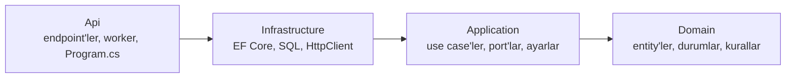
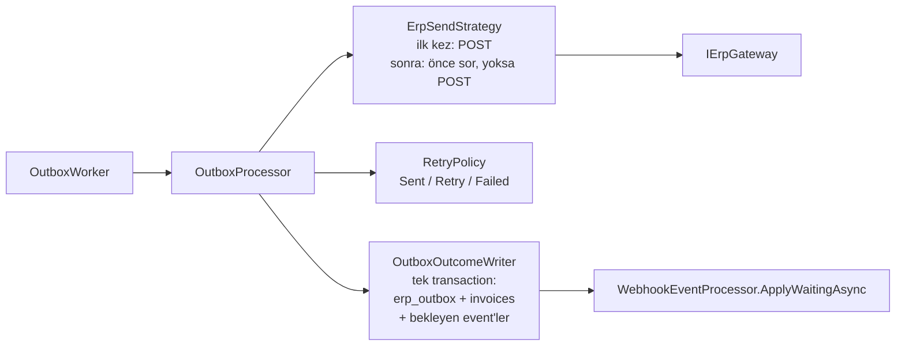

# Mimari

İki uygulama da (Invoice Service ve ERP Simulator) aynı katmanlı yapıdadır: her biri dört projeye bölünmüştür ve
projeler arasındaki referanslar tek yönlüdür.

## Katmanlar ve bağımlılık kuralı



| Katman | Ne içerir | Neye bağımlı olabilir |
|---|---|---|
| **Domain** | Entity'ler (`Invoice`, `ErpOutboxEntry`, `ErpWebhookEvent`; simülatörde `ErpInvoice`, `WebhookDelivery`), durum sabitleri, saf kurallar (`InvoiceTransitions`) | Hiçbir şeye (paket referansı yok) |
| **Application** | Use case'ler (bir işin adımlarını yöneten sınıflar), port'lar (dış dünyaya açılan arayüzler), ayarlar ve doğrulayıcıları, saf politikalar (`RetryPolicy`, `BehaviorSelector`, `WebhookPlanner`) | Domain; `Microsoft.Extensions.*` soyutlamaları (Options, Logging, DI) |
| **Infrastructure** | Port'ların gerçek uygulamaları: `DbContext`, migration'lar, SQL içeren store'lar, ERP'ye / Fatura Servisi'ne giden HTTP istemcileri | Application (ve dolaylı olarak Domain); EF Core, Npgsql |
| **Api** | HTTP endpoint'leri (isteği use case'e verir, sonucu HTTP cevabına çevirir), arka plan worker'ları, `Program.cs`, `appsettings*.json` | Hepsi |

Kural: içteki katman dıştakini bilmez. Örneğin `OutboxProcessor` (Application) PostgreSQL'i ya da `HttpClient`'ı
bilmez; yalnızca `IOutboxStore` ve `IErpGateway` port'larını bilir. Bu yüzden birim testlerde bu port'lar
bellek içi sahteleriyle değiştirilebilir (bkz. [Testler](#testler)).

## Invoice Service

```
invoice-service/
  src/
    InvoiceService.Domain/
      Invoices/        Invoice, InvoiceStatus, InvoiceNumber, InvoiceTransitions
      Outbox/          ErpOutboxEntry, OutboxStatus
      Webhooks/        ErpWebhookEvent, WebhookEventType, WebhookEventStatus, IgnoreReason
    InvoiceService.Application/
      Abstractions/    IErpGateway, IInvoiceStore, IOutboxStore, IWebhookEventStore, IUnitOfWork, IDatabaseFailureClassifier
      Invoices/        CreateInvoiceHandler, ResendInvoiceHandler, InvoiceQueries, CreateInvoiceRequest
      Outbox/          OutboxProcessor, ClaimedEntry, ErpSendStrategy, OutboxOutcomeWriter, RetryPolicy, OutboxOptions
      Webhooks/        WebhookEventProcessor, InvoiceEventApplier, ErpWebhookRequest, WebhookSignature, WebhookOptions
      DependencyInjection.cs
    InvoiceService.Infrastructure/
      Persistence/     InvoiceDbContext, Migrations/, InvoiceStore, OutboxStore, WebhookEventStore, UnitOfWork,
                       PostgresFailureClassifier
      Erp/             ErpClient (IErpGateway), ErpOptions
      DependencyInjection.cs
    InvoiceService.Api/
      Invoices/        InvoiceEndpoints, InvoiceResponse
      Webhooks/        WebhookEndpoints, WebhookRequestReader
      Workers/         OutboxWorker
      Startup/         LoggingExtensions, OpenApiExtensions, DatabaseMigrator, SettingsLogger
      Program.cs
  tests/
    InvoiceService.Domain.Tests / .Application.Tests / .Infrastructure.Tests / .Api.Tests
```

### Port'lar

| Port | Ne için | Uygulaması |
|---|---|---|
| `IErpGateway` | ERP'ye faturayı gönder (`SendAsync`), ERP'ye faturayı sor (`FindAsync`); her çağrı tek HTTP isteği | `ErpClient` |
| `IInvoiceStore` | `invoices` tablosu: numara üret, fatura + outbox kaydını birlikte yaz, oku, koşullu güncelle, satır kilidi | `InvoiceStore` |
| `IOutboxStore` | `erp_outbox`: `FOR UPDATE SKIP LOCKED` ile kayıt al, claim hâlâ bizde mi, sonucu claim'e göre yaz, sıfırla | `OutboxStore` |
| `IWebhookEventStore` | `erp_webhook_events`: bir kez sakla (`ON CONFLICT`), oku, bekleyenleri kilitle, `SET LOCAL` süre limitleri | `WebhookEventStore` |
| `IUnitOfWork` | Transaction sınırı: aynı DI scope'undaki store'lar aynı transaction'a katılır | `UnitOfWork` |
| `IDatabaseFailureClassifier` | Veritabanı hatası `lock_timeout` / `statement_timeout` mu (webhook'ta 503 için) | `PostgresFailureClassifier` |

### Akışlar

**Fatura oluşturma** — `POST /api/v1/invoices` → `CreateInvoiceHandler`: doğrula, numara al, faturayı ve outbox
kaydını tek kayıtta yaz (`IInvoiceStore.QueueAsync`) → `202`. ERP bu istekte çağrılmaz.

**Gönderim** — `OutboxWorker` (Api) boş slot kadar kaydı `OutboxProcessor.ClaimAsync` ile alır ve her biri için
yeni bir DI scope'unda `OutboxProcessor.SendAsync` çağırır:



**ERP webhook'u** — `POST /api/v1/erp-webhooks` → `WebhookEndpoints` gövdeyi okur, imzayı ve gövdeyi doğrular,
işi kendi scope'unda `WebhookEventProcessor.ReceiveAsync`'e verir ve en fazla `ResponseBudgetMilliseconds` bekler
(yoksa `503`). `WebhookEventProcessor` event'i bir kez saklar, faturayı kilitler ve `InvoiceEventApplier` ile uygular
(geçiş kuralları `InvoiceTransitions`'ta).

**Yeniden gönderme** — `POST /api/v1/invoices/{n}/resend` → `ResendInvoiceHandler`: yalnızca Başarısız fatura
Bekliyor'a döner ve outbox kaydı sıfırlanır (tek transaction); sonuç `Queued` / `NotFound` / `NotFailed` → `202` /
`404` / `409`.

## ERP Simulator

```
erp-simulator/
  src/
    ErpSimulator.Domain/
      Invoices/        ErpInvoice
      Webhooks/        WebhookDelivery, DeliveryStatus, DeliveryKind, ErpEventType
    ErpSimulator.Application/
      Abstractions/    IErpInvoiceStore, IWebhookDeliveryStore, IWebhookTransport, IUnitOfWork
      Invoices/        SubmitInvoiceHandler, InvoiceLookup, CreateInvoiceRequest
      Simulation/      BehaviorSelector, SimulatorOptions
      Webhooks/        WebhookSender, WebhookPlanner, WebhookSignature, WebhookOptions
      DependencyInjection.cs
    ErpSimulator.Infrastructure/
      Persistence/     ErpDbContext, Migrations/, ErpInvoiceStore, WebhookDeliveryStore, UnitOfWork
      Webhooks/        HttpWebhookTransport (IWebhookTransport)
      DependencyInjection.cs
    ErpSimulator.Api/
      Invoices/        InvoiceEndpoints, InvoiceResponses
      Workers/         WebhookDispatcher
      Startup/         LoggingExtensions, OpenApiExtensions, DatabaseMigrator, SettingsLogger
      Program.cs
  tests/
    ErpSimulator.Application.Tests / .Infrastructure.Tests
```

**Fatura POST'u** — `InvoiceEndpoints` → `SubmitInvoiceHandler`: doğrula, (idempotent modda) fatura numarasını
kilitle ve var olan kaydı ara, davranışı seç (`BehaviorSelector`), davranışa göre kaydet (`IErpInvoiceStore.SaveAsync`
kaydı ve `WebhookPlanner`'ın planladığı event'leri tek transaction'da yazar), geç cevapta bekle. Sonucu
(`Decided` / `Duplicate` / `Conflict` / `Invalid`) HTTP cevabına endpoint çevirir (`202`, `429` + `Retry-After`,
`500`, `409`, `400`).

**Webhook gönderimi** — `WebhookDispatcher` (Api) yalnızca döngüdür: zamanı gelen satırları alır, aynı anda en fazla
`MaxConcurrentSends` gönderir. Her satır için `WebhookSender` imzalar (fake: yanlış anahtar, replay: eski timestamp),
`IWebhookTransport` ile gönderir, sonucu ve bekleyen replay'leri tek transaction'da yazar.

## Tasarım kararları

Kod içindeki açıklamalar kısa tutuldu; bir kararın neden böyle olduğu burada.

### Gönderim (Invoice Service, outbox)

- **Önce sor, sonra gönder.** ERP bir faturayı kaydedip bunu bize söylemeyebilir (kaydettikten sonra 500, zaman
  aşımından sonra gelen cevap, gönderim sırasında öldürülen servis). Bu yüzden daha önce denenmiş bir fatura için
  `ErpSendStrategy` önce ERP'ye sorar; yalnızca ERP açıkça "yok" (404) derse yeniden POST eder. Cevap belirsizse hiçbir
  şey göndermez, deneme sonra tekrarlanır.
- **Bu korumanın sınırı.** ERP'nin, aldığı bir isteği sorulduğu anda göstermesine dayanır. Simülatör cevap vermeden
  önce kaydettiği için hep gösterir; ama kaydı daha da geciktiren bir ERP 404 dönebilir ve fatura iki kez kaydedilebilir.
  Bunu yalnızca ERP'nin aynı fatura numarasına ikinci kaydı reddetmesi kesin önler (`Simulator:IdempotentInvoices`,
  varsayılanı kapalı).
- **Vazgeçmeden önce son kez sorma.** Son deneme ERP'de kaydedilmiş olabilir. Bu yüzden Başarısız yazmadan önce ERP'ye
  bir kez daha sorulur; kayıt varsa fatura Gönderildi olur. Son denemesi yarıda kalan kayıt (sayaç zaten sınırda) bir
  daha POST edilmez, yalnızca sorulur.
- **Deneme, gönderimden önce sayılır.** Kayıt alınırken (`OutboxStore.ClaimAsync`) sayılır; cevap hiç gelmese de deneme
  kayıtlı kalır. Bu yüzden `send_attempt_count` ERP'nin aldığı POST sayısından büyük olabilir.
- **İki kopya aynı kaydı almaz.** Kayıt alma tek SQL ifadesidir: `FOR UPDATE SKIP LOCKED` ile her kopya diğerinin
  aldığı satırları atlar; `locked_until` satırın kime ait olduğunu ifade bittikten sonra da gösterir.
- **Claim token.** Her alımda yeni bir kimlik yazılır. Kilidi süresi dolmuş (örneğin takılıp kalmış) bir worker'ın
  kimliği artık eşleşmez; ne POST edebilir ne de sonucu, kaydı ondan sonra alanın sonucunun üzerine yazabilir.
- **Kilit süresi.** `Outbox:LockSeconds`, bir denemenin en uzun süresinden (sor + gönder + son kez sor =
  3 × `Erp:TimeoutSeconds`) uzun olmak zorunda; değilse ikinci bir worker hâlâ gönderilmekte olan kaydı alabilir.
- **Jitter.** Birlikte hata alan faturalar (örneğin ERP kapalıyken) aynı anda yeniden denenip toparlanan ERP'ye tek
  dalga hâlinde yüklenmesin diye bekleme süresine rastgele bir sapma eklenir. 429'da eklenmez; ERP ne zaman
  denenebileceğini zaten söylemiştir.
- **60 saniye sınırı planlanan beklemeye aittir.** Worker kuyruğa birkaç yüz milisaniyede bir baktığı için iki deneme
  arasında ölçülen süre bu sınırı birkaç milisaniye aşabilir (Gün 3'te 60,010 sn ölçüldü). Bunu ayrıca bir ayarla
  telafi etmek yerine bilinen bir sınır olarak bırakıldı.
- **HTTP istemcisinde retry yok.** Her çağrı tam bir HTTP isteğidir; tekrar deneme kararı yalnızca `RetryPolicy`'dedir.

### ERP haberleri (Invoice Service)

- **Faturadan önce gelen haber.** Bekliyor olarak saklanır. Haberle ilgili her karar faturanın satır kilidi
  (`SELECT ... FOR UPDATE`) tutularak verilir; outbox da faturayı Gönderildi yaparken aynı satırı kilitler. Böylece
  "fatura henüz Gönderildi değil, haber beklesin" ile "fatura artık Gönderildi, bekleyenleri işle" iç içe geçemez.
- **Bekleyen haberler geliş sırasıyla işlenir** (`received_at`), oluşma zamanına göre değil. Böylece bir haber, fatura
  geldiği anda Gönderildi olsa da olmasa da aynı sonucu verir.
- **Aynı haberin aynı anda gelmesi.** `INSERT ... ON CONFLICT (event_id)`: satırı yalnızca bir istek ekler, diğerleri
  onun kilidini bekleyip yalnızca `delivery_count`'u artırır (`RETURNING xmax = 0` hangisinin eklediğini söyler).
  Faturaya yalnızca ekleyen istek işler.
- **5 saniye kuralı.** Haber, isteğin kendisinden ayrı bir DI scope'unda işlenir ve cevap en fazla
  `ResponseBudgetMilliseconds` bekler; süre dolarsa 503 döner ve ERP haberi yeniden gönderir. PostgreSQL'in
  `lock_timeout` ve `statement_timeout` değerleri de (`SET LOCAL`) işi sunucu tarafında durdurur. İş 503'ten hemen sonra
  yine de tamamlanırsa, bir sonraki teslim yalnızca tekrar sayılır.
- **İmza sabit zamanlı karşılaştırılır**, böylece cevap süresi bir saldırgana tahmin ettiği imzanın ne kadarının doğru
  olduğunu söylemez.

### ERP Simulator

- **Her POST aynı sayıda çekiliş yapar** (davranış + Retry-After); dizi yalnızca seed'e ve istek sırasına bağlıdır.
- **Webhook planlaması kendi RNG'sini kullanır**, böylece POST'ların davranış dizisini kaydırmaz; her fatura da seçilen
  sorunlardan bağımsız olarak aynı sayıda çekiliş yapar.
- **Sıra karışmasında yalnızca gönderim zamanları değişir**; haberlerin oluşma zamanları gerçek sırada kalır.
- **Gövde bir kez oluşturulur**: her gönderim ve çift gönderim aynı baytları taşır, gönderim anında yalnızca zaman
  damgası ve imza üretilir.
- **Tekrar gönderim aralıkları bir önceki gönderimin başlangıcından sayılır**; cevapsız kalan ve tam zaman aşımını
  bekleyen bir gönderim aralıkları uzatmaz.
- **Idempotent modda benzersiz indeks yerine kilit** (fatura numarasından üretilen PostgreSQL advisory lock): mevcut
  çift kayıtlar geçerli kalır ve ayar yeniden kapatılabilir.

## Testler

| Proje | Ne test eder |
|---|---|
| `*.Domain.Tests` | Saf kurallar: durum geçişleri, fatura numarası biçimi |
| `*.Application.Tests` | Politikalar ve doğrulamalar (`RetryPolicy`, imza, ayarlar, istek doğrulama, `BehaviorSelector`, `WebhookPlanner`) ve **use case'ler port'ların bellek içi sahteleriyle** (`Fakes/`): veritabanı ve HTTP olmadan gönderim akışı, yeniden gönderme, webhook işleme, simülatörün davranışları ve webhook gönderimi |
| `*.Infrastructure.Tests` | `ErpClient` (sahte `HttpMessageHandler` ile), ERP ayarları, migration'ların modeli hâlâ tarif ettiği (veritabanı gerekmez) |
| `InvoiceService.Api.Tests` | Projeyle gelen `appsettings.json` değerleri |

```bash
dotnet test invoice-service
dotnet test erp-simulator
```

## Bilinçli uzlaşmalar

Kitaptaki en katı hâli değil, davranışı değiştirmeden varılabilen pragmatik hâlidir:

- **Tracked entity'ler port sözleşmesinde.** `IInvoiceStore.LockAsync` ve `IWebhookEventStore.GetTrackedAsync`
  EF'in takip ettiği nesneleri döndürür; değişiklikler `IUnitOfWork.SaveChangesAsync` ile yazılır. Port'lar EF'e
  bağlı değildir ama bu davranışı varsayar. Mantığı aynı tutmanın en az değişiklikli yolu buydu.
- **Simülatörde kilit ve kayıt örtük bağlı.** `IErpInvoiceStore.LockInvoiceNumberAsync`'in açtığı transaction'ı
  `SaveAsync` kendisi bulur ve commit eder (eski kodla aynı).
- **Application, `Microsoft.Extensions.*` soyutlamalarını kullanır** (Options, Logging, DI). Yaygın kabul gören bir
  uzlaşmadır; somut altyapıya (EF, HTTP) bağımlılık yoktur.
- **SQL'ler olduğu gibi taşındı.** `FOR UPDATE SKIP LOCKED`, `ON CONFLICT`, `SET LOCAL` gibi ifadeler doğruluk için
  kritik olduğundan yeniden yazılmadı; Infrastructure'daki store'larda duruyorlar.
- **Log kategorileri.** Mesaj metinleri aynı; sınıf adından gelen kategoriler yeni namespace'leri taşır (örn.
  `InvoiceService.Application.Outbox.OutboxProcessor`). Bunu kullanan `manual-tests/gun3` script'leri güncellendi.
  Fatura use case'leri (`InvoiceService.Invoices`, `ErpSimulator.Invoices`) ve simülatörün `webhooks` HttpClient'ı
  eski kategorilerini korur.
